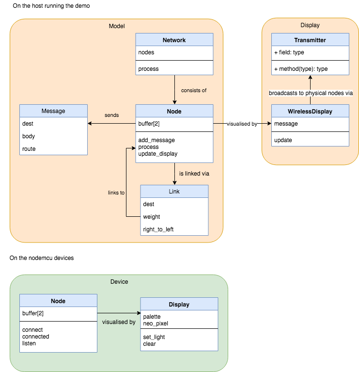
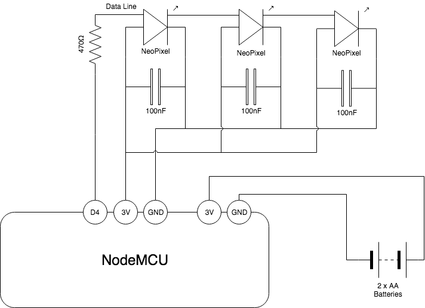

# Model Arpanet

Model of the Arpanet featuring Blinkenlights.  Used in my talk [Agile Insights from the Birth of the Internet](https://speakerdeck.com/worldofchris/agile-insights-from-the-birth-of-the-internet) at [Lean Agile Scotland 2018](http://leanagile.scot/2018/sessions/index.php?session=102).

## Dependencies

The model ARPANET IMPs code requires [Python 3](https://www.python.org/), tested with Python 3.6.5, for the host and [MicroPython](https://micropython.org/) for the [nodemcu](http://nodemcu.com/index_en.html) IMPs. 

The IMP is wired up to three [neopixels](https://www.adafruit.com/product/1938):  

L-R Prototype breadboard build, build soldered on to protoboard, soldered build mounted in an ABS project box.

To get started, install the Python dependencies with:

	make develop

## Configuring the IMP

First erase the flash on the nodemcu:

	make erase

Then flash with the [MicroPython firmware](https://docs.micropython.org/en/latest/esp8266/esp8266/tutorial/intro.html#getting-the-firmware):

	make flash
	
## Running the tests

	make test

## Deploying to a nodemcu

Put the `SSID` and `password` for the WIFI you are using in a file called `wifi.txt` in the format:

	ssid,password

Then deploy with:

	make deploy [NODENAME=name]

Where `name` is the unique name for the IMP which it uses to identify messages broadcast from the host.

To get to the REPL on the device:

	picocom -b 115200 /dev/tty.SLAB_USBtoUART

## Running the demo from the talk

The demo of messages on the four node ARPANET is run with:

	python script.py

The disco lights bit at the end of the talk with:

	python disco.py

## Software Design

## Hardware Design

